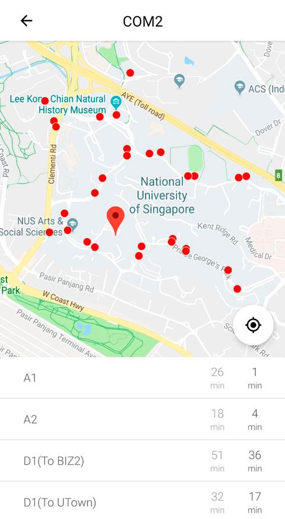

# NUSBus app 
Open source Android app for NUS shuttle buses. 

## App information
* **Requires Android**: 4.1 and up
* **Current versions**: 1.0

## Screenshots

## Build instruction
1. Clone this repository
2. Generate "Maps SDK for Android" API key for GoogleMaps (find more information about it [here](https://developers.google.com/maps/documentation/javascript/get-api-key))
3. Put generated API key into `app/src/debug/res/values/google_maps_api.xml`
4. Run the following gradle task to assemble debug APK: `./gradlew assembleDebug`
5. Assembled APK file will be located here: `app/build/outputs/apk/debug/app-debug.apk`

## Used technologies
App is implemented in [Kotlin language](https://kotlinlang.org/) with using the following libraries:
* [GoogleMaps](https://developers.google.com/maps/documentation/android-sdk)
* [Retrofit2](https://square.github.io/retrofit/)
* [Dagger2](https://google.github.io/dagger/)
* [Room](https://developer.android.com/topic/libraries/architecture/room)
* [RxPM](https://github.com/dmdevgo/RxPM)
